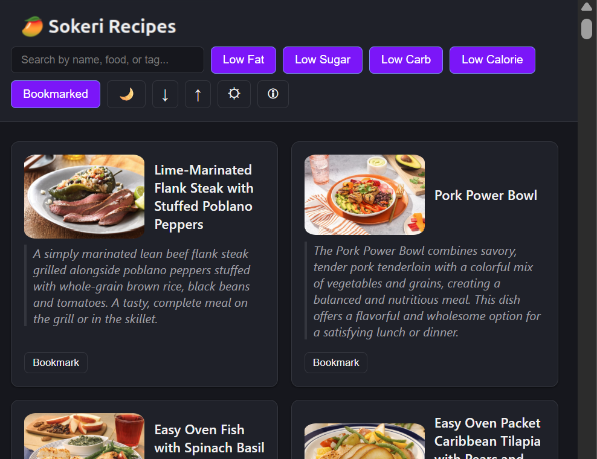

# Sokeri Cooking App: Healthy Recipes and Meal Planning

The app was developed for finding healthy recipes that are easy to cook. 

You can try out the app by clicking here [[link]](https://jamesatzberger.github.io/app-sokeri-cooking/index.html).

## More Details 

You can sort by food types, amount of fat or sugar, and other filters. 

By clicking the gear button you can customize the levels for sugar, fat, and other 
conditions.

You click the recipe description to get the full set of instructions for cooking it.

By bookmarking recipes you also can save them for later and download them for meal
planning and to share with other people.  
 
 

I hope you enjoy! 
 

Please try out the app by clicking here [[link]](https://jamesatzberger.github.io/app-sokeri-cooking/index.html).

