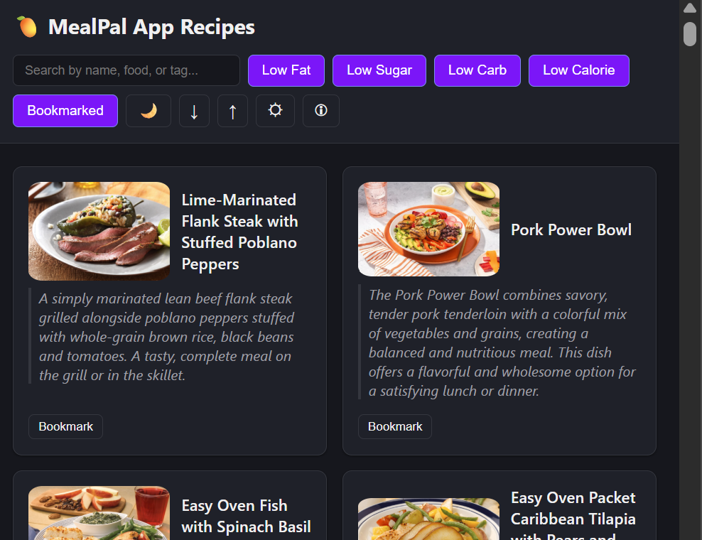
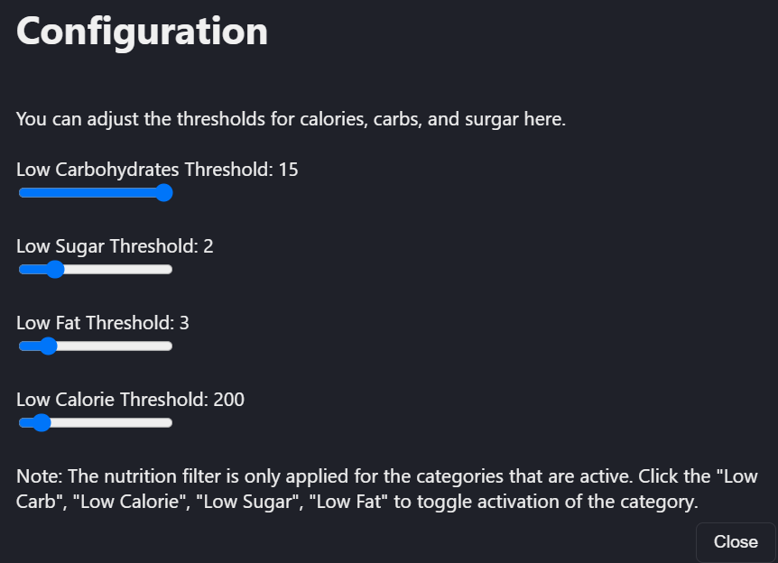
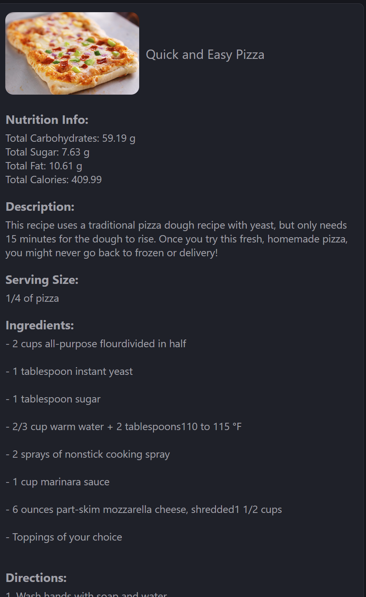

# MealPal App: Recipes for Healthy Cooking 

The app was developed for finding healthy recipes that are easy to cook. 

You can sort by food types, amount of fat or sugar, and other filters. 

By clicking the gear button you can customize the levels for sugar, fat, and other 
conditions.

You click the recipe description to get the full set of instructions for cooking it.

By bookmarking recipes you also can save them for later and download them to 
share with other people.  

I hope you enjoy! 

Please try out the app by clicking here [link](https://jamesatzberger.github.io/app-mealpal/index.html).

